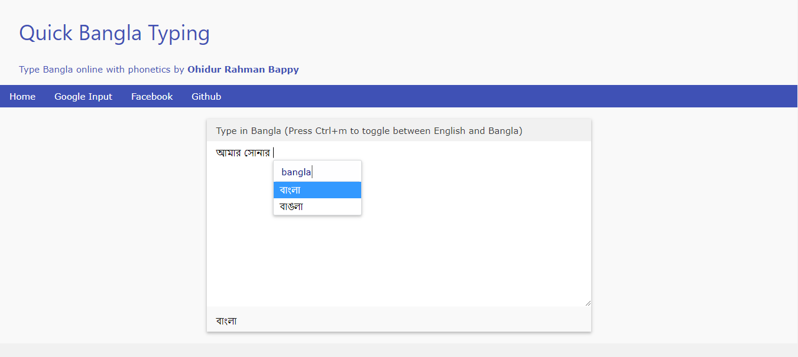

# quick-bangla-typing
Easily type Bangla on website with word suggestion

Live Version:
http://www.bappy.cf/apps/qbn

It is a modified version of jquery.bangla
The original repository is available here:
https://github.com/dipu-bd/jquery.bangla
and the live version of the source is available here:
https://dipu-bd.github.io/jquery.bangla/
